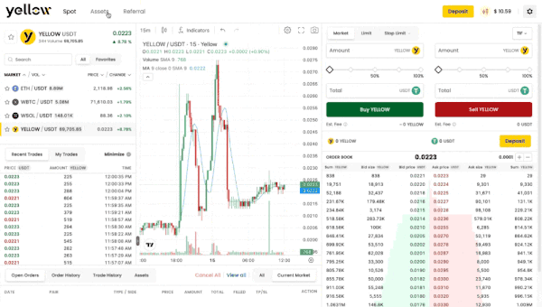

# How to Withdraw

How you withdraw depends on how you signed in. Use the tab that matches your account type.


Before withdrawing, review [Supported Networks, Assets & Limits](supported-networks-assets-limits.md) for the supported network, minimum amounts, network fees, and the rule that **withdrawals are final and cannot be reversed**.




External wallet users withdraw funds **directly from the Trading Account (`Spot Account`)** to their connected wallet. No Account Balance step is involved.

**Prerequisites**

* Your external wallet is connected.
* Funds are available in your Trading Account (`Spot Account`) and not locked in open orders, positions, or margin.
* If funds are in the Perpetual Account, transfer them to the Trading Account first (see below).

**Steps**

1. Open `yellow.pro/assets/withdraw`.
2. Your connected wallet and network are selected automatically.
3. Select the asset.
4. Enter the amount.
5. Review the estimated network fee and final amount received.
6. Click **Withdraw** to submit.

No recipient address entry is required — your connected wallet is used automatically.

**If funds are in the Perpetual Account:** open `yellow.pro/assets/perps`, click **Transfer**, move funds Perpetual Account → Spot Account (instant), then return to the Withdraw page.



Google account users withdraw from their **Account Balance (`Yellow Wallet`)**. Funds must reach Account Balance before an on-chain withdrawal can be executed, and you enter the recipient address manually.

**Prerequisites**

* Funds must be in your Account Balance (`Yellow Wallet`) to initiate withdrawal.
* If funds are in the Perpetual Account → transfer to Trading Account (`Spot Account`) first.
* If funds are in the Trading Account → transfer to Account Balance (`Yellow Wallet`) first.
* Funds are not locked in open orders, positions, or margin.

**Prepare your funds (if needed)**

1. **Perpetual → Spot:** open `yellow.pro/assets/perps`, click **Transfer**, move Perpetual Account → Spot Account (instant).
2. **Spot → Account Balance:** open `yellow.pro/assets`, click **Transfer**, move Trading Account (`Spot Account`) → Account Balance (`Yellow Wallet`) (on-chain, may take time). Wait for it to complete.

**Steps**

1. Open `yellow.pro/assets/withdraw`.
2. Enter the recipient's external wallet address (any wallet on the Ethereum network).
3. Select the asset.
4. Enter the amount.
5. Review the estimated network fee and final amount received.
6. Click **Withdraw** to submit.


Your Account Balance uses smart wallet abstraction. Some receiving platforms don't automatically detect smart wallet balances. Verify the receiving platform is compatible with Ethereum smart contracts before withdrawing.




## Processing Time

Most withdrawals complete within a few minutes. During Ethereum network congestion, processing may take up to 1 hour or longer. Track your status — including TxID, network fee, and final amount — at `yellow.pro/assets/history`.

## Related Articles

* [Supported Networks, Assets & Limits](supported-networks-assets-limits.md)
* [How to Transfer Funds Between Accounts](../account-and-balance/transfer-funds-between-accounts.md)
* [Deposit & Withdrawal Troubleshooting](troubleshooting.md)
