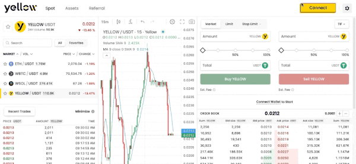
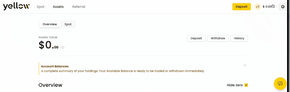

# How to Connect Your Wallet

To start using Yellow.pro, you first need to connect a supported wallet or sign in using Google. Yellow.pro currently supports:

* MetaMask
* Rabby
* Phantom
* WalletConnect (560+ wallets)

This guide explains how to connect an external wallet to the platform.



### Open the connection window

Go to [yellow.pro](https://yellow.pro) and click the **Connect** button in the top-right corner of the screen. This opens the wallet connection window where you can choose your preferred login method.



### Choose your wallet

Select the wallet you want to use. Most users connect through MetaMask, Rabby, Phantom, or WalletConnect.

If your wallet is not directly shown, use **WalletConnect** to search from 560+ supported wallets.




### Approve the connection

After selecting your wallet:

1. your wallet application or browser extension opens
2. Yellow.pro requests wallet connection approval
3. approve the connection inside your wallet

Depending on the wallet you use:

* browser extension wallets may open automatically
* mobile wallets may require scanning a QR code
* some wallets may open in a separate browser tab or redirect temporarily



### Sign the authentication message

After approving the connection, your wallet asks you to sign a message. This signature is used only to authenticate your login session.


Signing this message **does not move funds**, is **not a blockchain transaction**, and triggers **no trading action**. It only authenticates your session.


You must complete both the **wallet connection approval** and the **signature request**. Cancelling either step means the wallet connection will not complete.



### Connection complete

Once connected successfully:

* the Connect button is replaced with your balance display
* your wallet address becomes visible in the account menu
* Deposit and trading features become available

You can now fund your account and start trading.



## WalletConnect Users

WalletConnect supports hundreds of wallets across desktop and mobile devices. A typical WalletConnect flow:

1. Select WalletConnect.
2. Choose your wallet.
3. Scan the QR code or open the wallet app.
4. Approve the connection.
5. Sign the authentication message.

If your wallet browser extension is not installed, the platform may display **Not Detected** along with download options, mobile app links, or browser extension links.

## Common Connection Issues

Wallet opens but connection does not complete

Sometimes the wallet signs successfully but the platform returns to the previous screen or does not log you in correctly. This can happen because:

* browser pop-ups are blocked
* redirect permissions are disabled
* wallet authentication opened in another browser tab
* browser cache caused session issues

Try the following:

1. Allow pop-ups and redirects for Yellow.pro.
2. Refresh the page after signing.
3. Try again using Incognito / Private mode.
4. Clear your browser cache if the issue continues.
5. Make sure the wallet app remains open during the process.

This issue is more common with some WalletConnect-based wallets that use external authentication flows.

QR code does not work

If the QR code cannot be scanned:

* refresh the QR code
* reopen the wallet app
* try WalletConnect again
* make sure the wallet supports WalletConnect connections

Wallet not detected

If your wallet extension is installed but not detected:

* refresh the browser
* unlock the wallet extension
* temporarily disable conflicting wallet extensions

## Disconnect or Log Out

To disconnect from Yellow:

1. Go to the top-right corner of the screen.
2. Click on your balance.
3. In the pop-up window, click **Disconnect**.

You don't need to sign any transaction to disconnect from the platform.

## Important Things to Know

* Yellow.pro supports only one active wallet connection at a time.
* Wallet connection approval and message signing are both required.
* Wallet signing does not give Yellow.pro control over your funds.
* If you cancel the signature request, the login session will not complete.
* If your wallet is unsupported directly, use WalletConnect.

## Related Articles

* [What is Yellow.pro?](what-is-yellow.md)
* [External Wallet vs Google Account](wallet-vs-gmail.md)
* [Users Journey on Yellow.pro](users-journey.md)
* [How to Deposit](../deposits-and-withdrawals/how-to-deposit.md)
