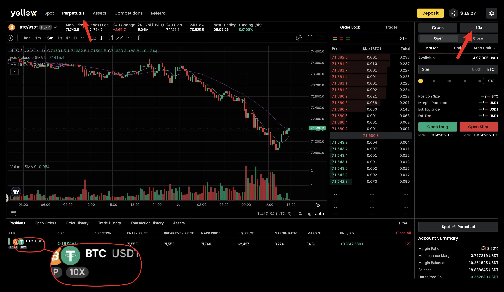

# Adjusting Margin & Leverage

In cross margin mode your entire available balance is shared collateral for all positions, so adjusting margin and leverage works a little differently than in isolated-margin systems.

## Adding Margin (Increasing Your Buffer)

There's no separate "add margin to position X" control in cross margin — you increase the buffer for **all** positions by adding funds:

1. **Deposit additional funds** into your Yellow.pro account.
2. Once credited and transferred to your **Perpetual** account, your available balance increases.
3. Your liquidation price moves **further** from the current market price for all open positions.

## Removing Margin

You can withdraw only your **Available Balance** — not funds committed to open positions. To free up more, **close or reduce** positions first.


Adding funds buys you more time if the market moves against you. You'll receive a [margin warning](../risk-and-liquidation/margin-warnings-and-risk-management.md) as your account approaches liquidation.


## Changing Leverage


You can change a market's leverage **only when you have no open orders** on that market. Cancel any open orders on the market first, then adjust the leverage.


1. Open your **open positions** panel.
2. Find the leverage setting for the market.
3. Adjust the multiplier with the selector.
4. Confirm the change.

| Action | Liquidation price | Margin required |
| --- | --- | --- |
| Increase leverage | Moves closer to market | Decreases |
| Decrease leverage | Moves further from market | Increases |


**Increasing leverage on an open position moves your liquidation price closer to the current price** — a smaller adverse move can liquidate you. Always check your new liquidation price after changing leverage, and don't increase leverage on a position already under margin pressure. If mid-position adjustment isn't available, close and reopen the position with the new leverage.


## Related Articles

* [Closing a Position](closing-a-position.md)
* [Margin & Leverage](../margin-and-leverage.md)
* [Liquidation & Mark Price](../risk-and-liquidation/liquidation-and-mark-price.md)
