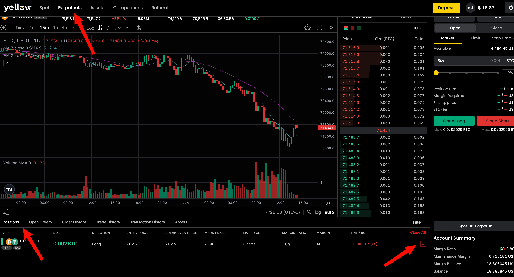
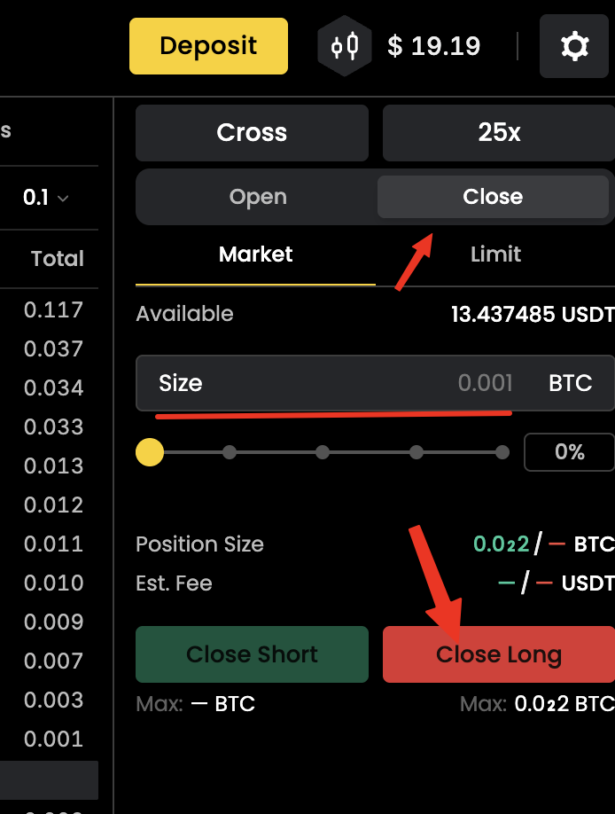

# Closing a Position (Full or Partial)

Closing a position locks in your **Realized PnL** and releases its margin back to your available balance. You can close fully or partially.

## Closing Fully

1. Go to the **Positions** panel at the bottom of the trading screen.
2. Find the position and click **Close** (or the X icon).
3. Choose the closing order type:
   * **Market** — closes immediately at the best available price.
   * **Limit** — closes at your specified price or better (may take time to fill).
4. Confirm.

Once filled, your realized PnL updates and the position's margin returns to your **Available Balance**.

## Closing Partially

1. Open the **Positions** panel and click **Close** on the target position.
2. Enter a quantity **less than** your total position size.
3. Choose market or limit, then confirm.

Only the specified amount is closed; the rest stays open at the original entry price, and margin adjusts proportionally.

> **Example:** you hold 2 ETH long and close 1 ETH with a market order → your position becomes 1 ETH long, and half the margin is released.

## Closing with a Limit Order

To close at a specific price (e.g. a take-profit level), select **Limit** in the close form, enter your exit price, and confirm. The order rests in the book until the market reaches your price; cancel it from **Open Orders** if needed.


Take Profit orders must currently be set manually — they are not automatically linked to a position.


## After Closing

* **Realized PnL** is credited or debited from your balance (trading fees are deducted).
* The position leaves the Positions panel and the closed trade appears in **Trade History**.
* In cross margin, closing one position can affect the others — always check your remaining balance.

**Tip:** use **market close** to exit quickly (e.g. to avoid liquidation); use **limit close** when you have a target price and aren't in a rush.

## Related Articles

* [Adjusting Margin & Leverage](adjusting-margin-and-leverage.md)
* [Understanding PnL](../pnl.md)
