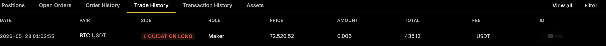

# Liquidation & Mark Price

## What is Liquidation?

**Liquidation** is the automatic closure of one or more open positions when your account no longer has sufficient margin to support them. It prevents your balance from going negative. You lose the margin allocated to the affected position(s), but never owe more than you deposited.

## When Does Liquidation Happen?

Liquidation triggers when your **Margin Ratio reaches 100%** — your account equity has dropped to the maintenance margin level:

`Margin Ratio = Maintenance Margin Required / Account Equity`

In **cross margin mode** (used on Yellow.pro), this is calculated across **all** your open positions together, not per individual position.

## The Liquidation Process

1. **Detection** — the system continuously monitors margin ratios.
2. **Trigger** — when your ratio hits the threshold, the liquidation engine activates.
3. **Closure** — your position(s) are closed using the **Mark Price**.
4. **Settlement** — any remaining balance after losses and liquidation fees is returned (often small or zero).
5. **Record** — the liquidation is logged in your Trade History.

## Liquidation Price

Your **Liquidation Price** is the estimated Mark Price at which your account would be liquidated, shown in the positions panel. In cross margin it is **not fixed** — it moves with your unrealized PnL, positions you open or close, and deposits or withdrawals.

## Mark Price vs Last Traded Price

Yellow.pro shows two prices, and the difference matters:

* **Last Traded Price** — the price of the most recent trade. It can be briefly distorted by large orders or thin liquidity.
* **Mark Price** — a calculated fair-value price derived from external reference data that smooths out temporary anomalies.

**Liquidation and unrealized PnL are based on the Mark Price**, not the last traded price.


This protects you both ways: a temporary spike in the last traded price that doesn't move the Mark Price will **not** liquidate you — but a drop in the Mark Price that isn't visible on the chart **can**. Always watch the Mark Price in your positions panel.


## How to Avoid Liquidation

* Set **stop-loss orders** to exit before the liquidation threshold (not guaranteed).
* **Add margin** (deposit funds) to increase your buffer.
* **Reduce position size or leverage** to lower the maintenance margin required.
* **Monitor your margin ratio** and act early. Make sure [margin warning emails](margin-warnings-and-risk-management.md) are enabled.

## Related Articles

* [Cross-Margin Risk & ADL](cross-margin-risk-and-adl.md)
* [Margin Warnings & Risk Management](margin-warnings-and-risk-management.md)
* [Margin & Leverage](../margin-and-leverage.md)
