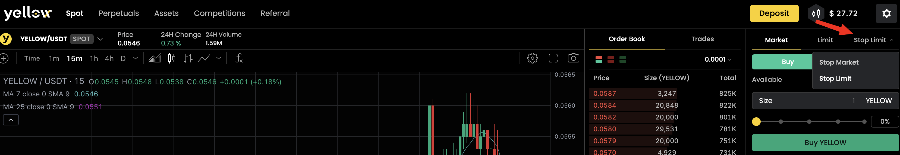
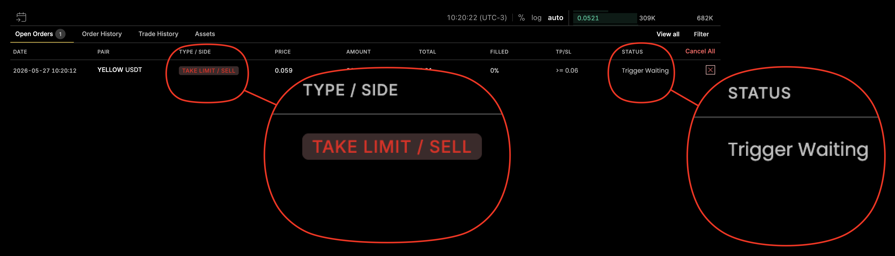

# Order Types

Yellow.pro supports **market** and **limit** orders, plus **conditional (stop) orders** that activate at a trigger price. The same order types and [Time in Force](#time-in-force-tif) options apply to both **Spot and Perpetual** markets (examples below use spot pairs). Understanding the difference helps you make better decisions and avoid unexpected outcomes.

## Market Order

A market order is designed for **immediate execution**, filling against the best available prices in the order book.

* **What you control:** the amount (quantity).
* **What you don't control:** the exact price.

**When to use:** you need to execute immediately, the exact price matters less than getting filled, and the market is liquid.

**Risk — slippage:** in fast-moving or low-liquidity markets, your final fill price may differ from the price displayed at submission. This is normal and expected.

## Limit Order

A limit order lets you **specify the exact price** at which you want to buy or sell. It only executes at that price or better.

* **Buy limit:** the maximum price you'll pay. A buy limit at 2,050 USDT waits until a seller offers at 2,050 or below.
* **Sell limit:** the minimum price you'll accept. A sell limit at 2,150 USDT only fills if a buyer pays 2,150 or above.

If your limit price matches existing orders already in the book, the order may fill **immediately**, acting like a market order — this means you were taking available liquidity at your stated price, not an error.

**When to use:** you want a specific price, you're not in a rush, and you want to avoid slippage. **Risk:** the order may never fill, and partial fills are possible.

### Market vs Limit — at a glance

| | Market Order | Limit Order |
| --- | --- | --- |
| Execution speed | Immediate | When price is matched |
| Price control | None | Full |
| Slippage risk | Yes | No (fills at your price or better) |
| Guaranteed fill | Very likely | Not guaranteed |
| Acts as | Always taker | Maker (if not filled immediately) or Taker |

## Conditional Orders (Stop Market & Stop Limit)

Conditional orders **do not activate immediately**. They wait for the market to reach a specified **trigger price**, then automatically submit a new order. This lets you set up automated entry or exit strategies without watching the market continuously.

### Stop Market

Triggers at your trigger price, then submits a **market order** immediately.

* **Fields:** trigger price, amount.
* **Use it to:** cut losses if the market drops to a level (stop-loss), or enter when the market breaks a level — when execution matters more than exact price.
* **Risk — gap:** the fill price may differ from your trigger price in fast-moving markets.

### Stop Limit

Triggers at your trigger price, then submits a **limit order** at your specified limit price.

* **Fields:** trigger price, limit price, amount.
* **Use it to:** keep price control even after the trigger fires.
* **Risk:** if the market moves quickly past your limit price, the order may **never fill**.

### Stop Market vs Stop Limit

| | Stop Market | Stop Limit |
| --- | --- | --- |
| After trigger | Submits a market order | Submits a limit order |
| Execution guarantee | High | Not guaranteed |
| Price control after trigger | None | Yes |
| Risk | Gap / slippage | Order may not fill |
| Best for | Ensuring exit | Controlling worst price |


Take Profit and Stop Loss must currently be created **manually** through the order form — they are not automatically linked to an existing position or order. After placing a TP/SL order, verify the trigger price, the order side, and that your available balance covers the order if it activates.


## Time in Force (TIF)

**Time in Force** controls how long an order stays active. Pick it from the **TIF** dropdown in the order form — it applies to both Spot and Perpetual orders.

| TIF | Name | Behaviour |
| --- | --- | --- |
| **GTC** | Good 'Til Cancelled | Rests in the book until it fully fills or you cancel it. **Default for limit orders.** |
| **IOC** | Immediate Or Cancel | Fills as much as possible right away; any unfilled remainder is cancelled. |
| **FOK** | Fill Or Kill | Must fill **completely and immediately**, or the entire order is cancelled. |

**Market orders are always IOC** — they execute immediately against available liquidity and cancel any unfilled remainder. The TIF selector applies to limit (and limit-style) orders, where **GTC is the default**.

## Maker vs Taker

Your order type affects whether you are a **maker** or a **taker**:

* **Taker** — your order consumes existing liquidity (market orders, or limit orders that fill immediately).
* **Maker** — your order adds liquidity to the book and waits.

See [Fees](../fees/trading-fees.md) for current maker and taker rates.

## Related Articles

* [How to Place a Spot Trade](how-to-place-a-spot-trade.md)
* [Managing Orders](managing-orders.md)
* [Fees](../fees/trading-fees.md)
