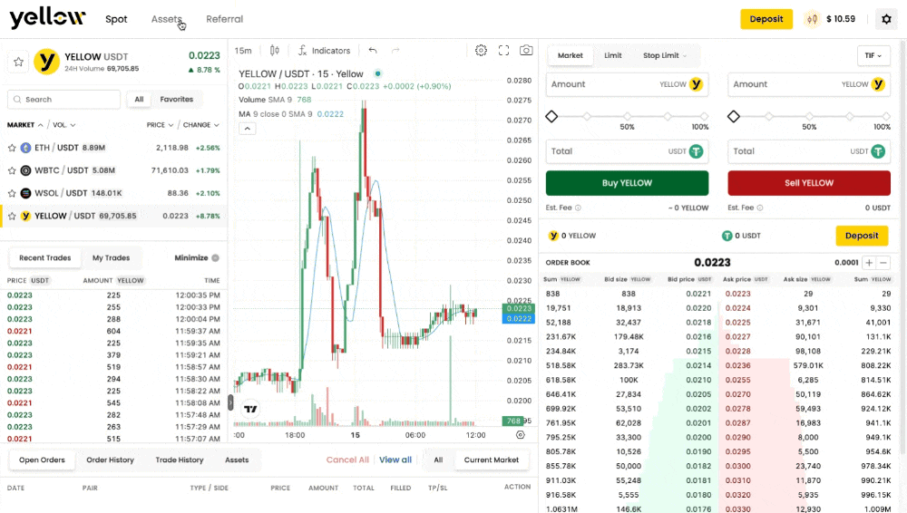

# What is Spot Trading?

Spot trading is the most straightforward way to trade on Yellow.pro. It is the direct exchange of one cryptocurrency for another at the current market price — you buy or sell an asset and receive it immediately in your account balance.

A spot market is always quoted as a pair, such as `ETH-USDT` or `BTC-USDT`, where:

* the asset on the **left** is the **base currency** (what you are buying or selling)
* the asset on the **right** is the **quote currency** (what you are paying or receiving)

> **Example:** trading `ETH-USDT` means you are exchanging ETH and USDT. If you buy, you spend USDT to receive ETH. If you sell, you spend ETH to receive USDT.

## How Spot Trading Works on Yellow.pro

Yellow.pro uses an **order book model** — when you place an order, it is matched against other traders' orders. When a spot order fills:

1. Your balance updates **immediately** on the platform after execution.
2. You can continue trading with your updated balance right away.
3. **No on-chain transaction occurs** for each trade. Assets only move on-chain when you **deposit** or **withdraw**.

This means trading is fast and efficient — every trade settles internally, and blockchain fees only apply at deposit and withdrawal.

## What You Can Trade

Yellow.pro offers a variety of spot markets, browsable in the markets list on the left panel of the trading interface. Each market has its own parameters:

* **Tick size** — the smallest price increment allowed
* **Step size** — the smallest quantity increment allowed
* **Minimum order size or value** — the smallest trade you can place
* **Fee rate** — the cost of executing a trade

## Spot vs Perpetual Trading

| | Spot | Perpetual |
| --- | --- | --- |
| What you trade | Actual assets | Contracts |
| Leverage | No | Yes |
| You own the asset | Yes | No |
| Risk | Limited to your balance | Can exceed your balance |
| Best for | Buying/holding crypto | Speculative or hedging strategies |

If you are new to trading, spot is the recommended starting point. Perpetual trading involves additional complexity and risk.

## Related Articles

* [How to Place a Spot Trade](how-to-place-a-spot-trade.md)
* [Order Types](order-types.md)
* [Managing Orders](managing-orders.md)
